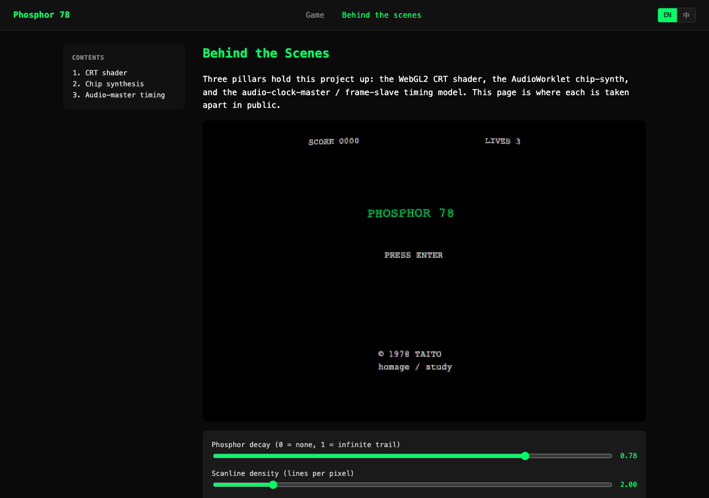

# Phosphor 78

> **A BMAD end-to-end practice run.** The deliverable is a
> museum-grade browser homage to 1978 Taito _Space Invaders_;
> the point is the four-phase workflow that produced it.

[简体中文 README](README.zh.md)

<p align="center">
  
  &nbsp;&nbsp;
  
</p>
<p align="center">
  <em>Left: the working game. Right: the documented practice — companion page with live tunables and teaching prose, EN / 中 in the header.</em>
</p>

## What this repo is

This repository is two things at once:

1. **A case study of BMAD** (the AI-assisted software
   development framework) applied end-to-end to one
   non-trivial project. The four phases — Analysis, Planning,
   Solutioning, Implementation — left a paper trail of
   `_bmad-output/` artifacts and per-story commits that you
   can read back to see how each decision was made.
2. **A working game** — a high-fidelity browser replica of
   the 1978 Taito arcade. WebGL2 CRT shader, AudioWorklet
   chip synthesis, ROM-cited gameplay constants. The
   `behind-the-scenes` page documents how each pillar was
   built, in English or Chinese.

Most "BMAD demo" repos stop at the planning artifacts. This
one runs all four phases through to a shipped artifact, so the
ratio of "documents about the practice" to "code shaped by the
practice" is honest.

## Two doors in

| If you came for...                  | Read this                                      |
| ----------------------------------- | ---------------------------------------------- |
| The BMAD methodology in practice    | [`docs/bmad-practice.md`](docs/bmad-practice.md) |
| The game itself (running, playing)  | [`docs/the-game.md`](docs/the-game.md)         |
| The chronological build log         | [`DEVLOG.md`](DEVLOG.md)                       |
| The planning artifacts BMAD generated | [`_bmad-output/`](_bmad-output/)             |

## Quick start

```bash
pnpm install
pnpm dev          # game on http://localhost:5173
pnpm test         # unit tests (396 passing)
pnpm test:e2e     # Playwright e2e (16 passing)
pnpm build        # production bundle (~70KB total)
```

The behind-the-scenes companion page is at
`http://localhost:5173/behind-the-scenes/` once `pnpm dev` is
running. Use the `EN | 中` toggle in the header to switch
languages.

## Project status

✅ **v1 candidate**. 49 planned stories complete + 8 playtest-driven
post-v1 fix stories. See
[v1 checklist](docs/v1-checklist.md) for the freeze gate
status, [`docs/bmad-practice.md`](docs/bmad-practice.md) for
what each phase produced, and [`DEVLOG.md`](DEVLOG.md) for the
per-story narrative.

## Legal

Phosphor 78 is an unofficial homage / educational study piece
of the 1978 Taito _Space Invaders_ arcade game. Non-commercial,
personal portfolio use only. Full legal notice in
[`docs/the-game.md`](docs/the-game.md#legal).
