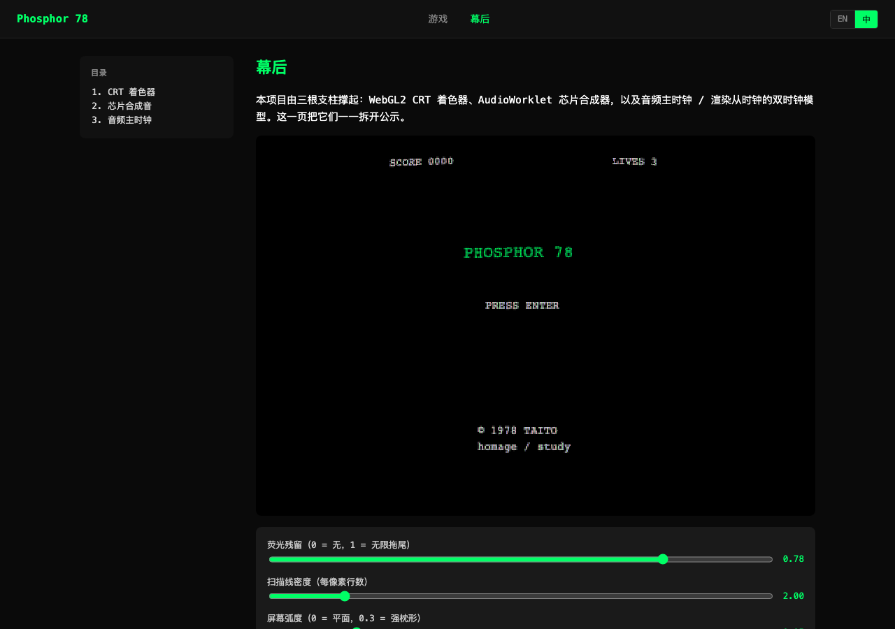

# BMAD 案例研究 -- 四阶段循环在本项目里产出了什么

> 一份回顾分析，对单个非平凡项目（即 `src/` 中的 1978 Space Invaders 致敬版）
> 端到端跑 BMAD 的复盘。
> 引用：本工作流所遵循的上游教程
> 在配套研究仓库的 `bmad-space-invaders-tutorial.md`。

这份文档是案例研究。它分门别类地记录每个 BMAD 阶段在本仓库实际产出了什么、
塑形每份产物的决策、本次实践与教程脚本的偏离之处，以及这些偏离的代价或节省。

如果你想看能跑的游戏，见 [the-game.zh.md](the-game.zh.md)。
如果你想看时间序的构建日志，见 [DEVLOG.md](../DEVLOG.md)。

  

  <em>幕后 companion 页面是“把实践跑到上线产物”最显眼的成果 -- Phase 1 的简报说文档要可交互、可实时调，Phase 3 的架构造出了让滑杆改动正在跑的游戏的信号 store，Phase 4 写出了散文。顶栏 EN / 中 可切。</em>

## 为什么这样定位项目

教程的承诺是 BMAD 的价值在于"在每个决策点留下书面记录，
让下次会话不必重新讨论上次的结论"。这个项目用一个具体的、跨周的实施
检验了这个承诺：5 个 epic 共 49 个 story、约 400 个单元测试、约 16 个 e2e 测试、
三根独立的技术支柱（WebGL CRT 着色器、Web Audio 芯片合成、引用 ROM 的玩法）。
`_bmad-output/` 里的产出物就是案例研究的数据来源。

## 各阶段的交付物

| 阶段          | 教程预期                         | 本项目产出                                                                                                                                                                                            |
| ------------- | -------------------------------- | ----------------------------------------------------------------------------------------------------------------------------------------------------------------------------------------------------- |
| 1 -- 分析     | `product-brief.md`               | [`product-brief-space-invaders.md`](../_bmad-output/planning-artifacts/product-brief-space-invaders.md) + [LLM 蒸馏版](../_bmad-output/planning-artifacts/product-brief-space-invaders-distillate.md) |
| 2 -- 规划     | `prd.md` + `ux-design.md`        | [`gdd-phosphor-78.md`](../_bmad-output/gdd-phosphor-78.md)（桥接 GDD；PRD + UX 合并）                                                                                                                 |
| 3 -- 方案设计 | `architecture.md` + `epics/*.md` | [`game-architecture.md`](../_bmad-output/game-architecture.md) + [`epics.md`](../_bmad-output/planning-artifacts/epics.md)                                                                            |
| 4 -- 实施     | 按 Sprint 组织的 story 执行      | 49 个 story，每个绑定一个 GitHub issue（#4–#67），commit message `<type>: 
 (#<n>)`，全部落 `main`                                                                                            |

### Phase 1 -- 分析

调用 analyst skill（`bmad-agent-analyst`，persona “Mary”），
请求一份关于 1978 Space Invaders 致敬版的产品简报。
两份文档落地：

- **完整简报**（`product-brief-space-invaders.md`） --
  面向人的、叙事式的，干系人会读的那种文档。
- **LLM 蒸馏版**（`-distillate.md`） -- 简报的压缩、token 节约形态，
  专门为下游 agent (架构师、story 作者) 准备，
  让它们不必每次读长版本就能消化简报。

这种双形态相对于教程是个小但实在的改进 -- 它承认下游消费者主要是 LLM，
给它们一个更密集的版本，能在每次后续 skill 调用上节省上下文 token。

这一阶段锁定的决策：

- **视觉保真档**：博物馆级 CRT，不是风格化的“复古”模仿。
- **音频路线**：振荡器图谱合成，bundle 不含任何音频文件。
- **商标处理**：项目命名为“Phosphor 78”，仓库名 / 应用名都不出现“Space Invaders”字样。
- **仓库形态**：GitHub Private；无公开部署目标（不上 GitHub Pages）。

### Phase 2 -- 规划

教程要求一份 PRD 加一份 UX 设计文档。本项目把两者压缩成单一的
**Game Design Document**（`gdd-phosphor-78.md`） -- 一部分原因是
对一个单屏 1978 固定射击游戏来说 PM/UX 阶段大半是仪式，
另一部分原因是简报已经把玩家面前的体验钉得够紧，
PRD/UX 拆开会产出两份大致互相转述的文档。

这是一个有意识的偏离：接受的取舍是需求与 UX 选择之间显式可追溯性变弱，
换得一份不需要和自己保持同步的单一事实来源。

功能/非功能需求仍带数字编号
（`FR1` … `FR26`、`NFR1` … `NFR30`），方便后续产出物
（架构、单个 story）引用。大致一半的 FR 直接映射到用户可见行为
（`FR12: 像素级侵蚀的堡垒`）；另一半是有意为之的保真约束
（`FR9: 三种外星人子弹，时分多路复用`）。

### Phase 3 -- 方案设计

架构得到了最重的对待。
[架构文档](../_bmad-output/game-architecture.md)
是 `_bmad-output/` 中最长的单一产出物。它的骨架：

- **11 个 ADR**（架构决策记录） -- 承重选择，
  比如“音频是主，渲染循环是从”（ADR-010）、
  “场景光栅化到 Canvas2D，再上传为 WebGL 纹理”（ADR-002）、
  “纯 reducer + 子 reducer 链”（ADR-001）。
- **8 个跨领域关注点**（CC1-CC8） -- 不属于任何一层的关注点：
  暂停行为、autoplay 解锁、WebGL2 能力探测、构建时档位阶梯。
- **13 个系统** -- 每一层托管的具体模块。
- **8 条架构边界**（AB1-AB8） -- 有方向的导入规则。
  最重要的是 **AB1**：`game/` 不能从 `render/` / `audio/` / `companion/`
  导入。游戏代码因构造而纯；所有可变的东西都在它的下游。
  ESLint 用 `no-restricted-imports` 强制 AB1。
- **14 条一致性规则**（CR1-CR14） -- 不关于分层的不变量，
  关于一层内部的纪律。CR1 是"reducer 链里禁止
  `Math.random` / `Date.now` / `console` / DOM 访问"。
  CR12 是“每个 ROM 引用的常量带引文注释”。
  CR4 是“导入用 `@/` 别名，不用相对父目录点号”。

让这一切在实践中真正起作用的纪律是 **49 个 story 全部引用其所在约束**。
一个典型的 story 描述读起来像“在 AB1、CR1、CR12 下实现 FR12 / FR16” --
所以打开这个 story 的开发者（或 AI agent）就知道哪些护栏是热的。

#### Advanced elicitation，不是 Party Mode

教程招牌的“Party Mode”多 persona 讨论，
在这里以 `bmad-advanced-elicitation` skill 的形式出现。
这个 skill 加载一份 elicitation 方法的 CSV (挑战、扩展、风险列表等)，
每次出 5 个候选。候选集按文档类型与近期会话偏置，不是随机。

举一个具体的例子：架构文档走到 Step 2 (项目上下文) 时，
elicitation skill 产出了 4 个挑战，其中 3 个导致了实际改动：

1. _"音频合成可能比 CRT 着色器更难 -- SN76477 的非线性 vs
   成熟的着色器文献。“_ → 把音频从”高“复杂度调到”很高"，
   导致采用了 AudioWorklet 加电路热度的设计而不是裸 `OscillatorNode`。
2. _"companion 页应该是高复杂度，不是中 -- 它是一个绑到两个 GPU/audio
   领域的热可调 GUI。"_ → 催生了信号 store 模式（`src/util/signals.ts`），
   让 companion 写入和 render / audio 层订阅的同一个信号。
3. _“是否漏了一个系统 -- timing oracle / event bus？”_ →
   把 `Clock` 接口加为独立类型（`src/types/clock.ts`），
   让 `game/` 可以依赖时钟契约而不导入音频实现。

第 4 个挑战（关于错分类的“中”复杂度）讨论后被拒绝 --
但拒绝本身记入了架构文档的修订记录，
所以未来读者能同时看到提示与选择。

#### Story 拆分：5 epic × 约 9 个 story

[epic 文档](../_bmad-output/planning-artifacts/epics.md)
把工作切成 5 个 epic 共 49 个 story：

| Epic | 主题                | Story    |
| ---- | ------------------- | -------- |
| 1    | 基础 + M1 占位      | 1.1-1.18 |
| 2    | 引用 ROM 的玩法     | 2.1-2.6  |
| 3    | 芯片合成 + 音频     | 3.1-3.6  |
| 4    | CRT 着色器栈        | 4.1-4.6  |
| 5    | Companion + v1 冻结 | 5.1-5.18 |

每个 story 写明验收标准与必须满足的 FR / NFR / ADR / AB / CR 编号。
这就是让前两段提到的纪律真正承重的机器 -- 没有逐 story 的引用列表，
那 14 条一致性规则只能停留在愿景层面。

### Phase 4 -- 实施

教程把实施定位为“基于 Sprint”：拉一批 story、做、演示。
这个项目把每个 story 当作 `main` 上的一个独立提交跑（无 Sprint 批量、
无 feature 分支；这是作者的明确偏好）。节奏是：

1. 给 story 开 GitHub issue (中文标题，英文工作记录)。
2. 端到端实现 story，包括测试。
3. 用 `<type>: 
 (#<issue>)` 提交。
4. 推到 `main`。
5. 用交付备忘关闭 issue (中文：成果 + 验证 + 后续)。

49 个 story × 每个约一个 issue = GitHub 项目上 #4 到 #67。
DEVLOG 条目按 epic 而非按日期组织，
所以读者可以端到端读 Phase 4 叙事，
不被“修 DEVLOG 错别字”这类提交穿插打断。

#### “v1 候选”之后发生了什么

Phase 4 有意思的那一半不是计划内的 49 个 story --
是 playtest 触发的 8 个 v1 后跟进 story（5.10 到 5.18）。
每一个的起点都是用户一句话的观察：

| Story | 触发                                                       |
| ----- | ---------------------------------------------------------- |
| 5.10  | “Game-over 按 Enter 不重开；sprite 是矩形；堡垒受损看不见” |
| 5.11  | “Alien 不啃堡垒；游戏结束触发太早；爆炸图不对”             |
| 5.12  | “重开还是不行；CRT 残影太重”                               |
| 5.13  | “behind-the-scenes 出中文版”                               |
| 5.14  | “原版 alien 真的这么快吗？”                                |
| 5.15  | “飞船过不了最右堡垒；击毙音是不是有？”                     |
| 5.16  | “`**bold**` 没渲染；中文段落里多空格”                      |
| 5.17  | “代码块每行一个 pill”                                      |
| 5.18  | “用 md-zh-format 工具处理 markdown”                        |

每一处修复走的是和计划内 story 同一套机器：专属 GitHub issue、
引用受约束的 FR / NFR / CR、合理处先写测试、提交带 issue 引用。
纪律没有因为应用到“小修小补”而拖慢 --
反倒让那些小修小补不致积累成债务堆。

## 本实践与教程的偏离之处

| 教程项目      | 本项目做法                        | 原因                                                     |
| ------------- | --------------------------------- | -------------------------------------------------------- |
| PRD + UX 文档 | 单一 GDD                          | 单屏游戏；PRD/UX 会互相转述                              |
| Sprint        | 每个 story 一个提交，不批量化     | 作者偏好；只走 main 分支（已记入 memory）                |
| Party Mode    | `bmad-advanced-elicitation` skill | 同样目标（多角度挑战草稿），选择更结构化                 |
| GitHub Pages  | 跳过                              | 项目选择保持 private 直到视觉质量过个人那关              |
| MAME 盲测     | 跳过（NFR8 标记为作者跳过）       | 需要装 MAME 加搞 ROM；按致敬 / 个人 portfolio 定位不值得 |
| 30 分钟讲解   | 跳过（story 5.7 标记为作者跳过）  | 个人手艺项目；没有讲解的对象                             |

这些偏离都是显式决策，记在 v1 冻结清单里附理由。
教程的价值主张两头都成立：哪怕你跳过一步，也记录*为什么*跳过，
这样跳过本身就可审计。

## 这套实践实际节省了什么（轶事）

因为每个 story 带引用列表（FR / NFR / AB / CR），
v1 后的几个修复能在分钟级而非小时级诊断出来。三个例子：

- **Story 5.12**（重开 bug）：用户报告“按 Enter 不重开”。
  一个新的全链路 reducer 集成测试证明 reducer 逻辑是对的。
  知道架构里说“render 与 reducer 各自可独立观察”
  （AB1 + CR1），下一个明显嫌疑就是 render 端的持久化 pass
  -- 果然就是那里。
- **Story 5.14**（alien 速度）：用户问“alien 真的这么快吗？”
  那个 tempo 函数还带着 Phase 3 规划期的 `// Story 2.1 will make this exact` 占位注释。
  架构的 CR12 (任何派生常量都要引用 ROM 来源) 让正确修复显而易见
  -- 把占位数学换成已经导入的
  `computer-archeology.ts` 中的 `marchDelayInterrupts(N)`。
- **Story 5.15**（右边界）：‘飞船过不了最右堡垒’。
  `shields.ts` 里的堡垒位置常量带一段注释复述其几何；
  对照 ROM 布局重读五分钟那段几何，就找出错在哪个 centerpoint 常量。

三个例子里时间节省都来自引用与约束记录 -- 不是 BMAD skill 调用本身。
skill 一次性产出了那些引用；约束一次又一次地在整个 v1 后修复循环里继续付费。

## 这套实践在本项目的限度

两条诚实的限制值得记下：

- **49 个 story 太多。** 一个更精简的首轮 -- 比如 20 个 story 配粗一点的验收标准 --
  会更快到达“v1 候选”，由同一个 playtest 驱动的跟进循环捕捉那些可见缺口。
  教程的 4 个 epic × 较小的 story 更接近这个规模项目的合适粒度；我们过度拆分了。
- **架构文档比必要的密。**
  对一个约 70 KB 单页 web 应用来说，11 个 ADR + 8 个 CC + 14 个 CR
  这套框架是有用的，因为它逼我们把不变量写下来，
  但更轻的笔触（5 个 ADR、不分 CC/CR）大概会以更少阅读量产出同样的代码。

这两条都不否定该实践的核心主张 -- 决策点的书面记录能减少跨会话的重复重审。
它们提示：这套实践被设计的项目体量大于本项目，
对一个单页游戏来说“用力过猛”是可以容忍的。

## 如果你想自己走一遍，阅读顺序

1. [`_bmad-output/planning-artifacts/product-brief-space-invaders.md`](../_bmad-output/planning-artifacts/product-brief-space-invaders.md)
   -- 开启一切的简报。
2. [`_bmad-output/gdd-phosphor-78.md`](../_bmad-output/gdd-phosphor-78.md)
   -- 合并的 PRD + UX。
3. [`_bmad-output/game-architecture.md`](../_bmad-output/game-architecture.md)
   -- 承重的约束文档。
4. [`_bmad-output/planning-artifacts/epics.md`](../_bmad-output/planning-artifacts/epics.md)
   -- 把架构变成代码的 49 个 story。
5. [`DEVLOG.md`](../DEVLOG.md) -- 按 epic 的叙事，
   讲每个 story 实际跑得怎样，包括 8 个 v1 后修复 story。
6. [`docs/the-game.zh.md`](the-game.zh.md) -- 产出的产物，
   带可玩说明。

按这个顺序读，项目同时讲两个故事：
BMAD 的四个阶段如何把一个想法变成上线产物，
以及那个特定产物为什么长成现在这个样子。
