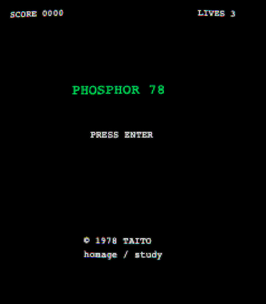
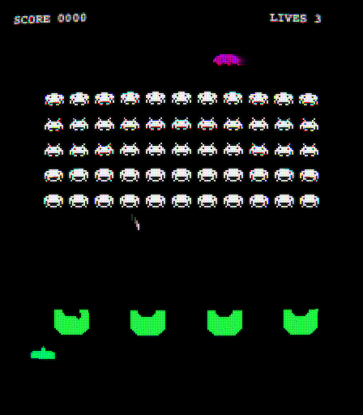
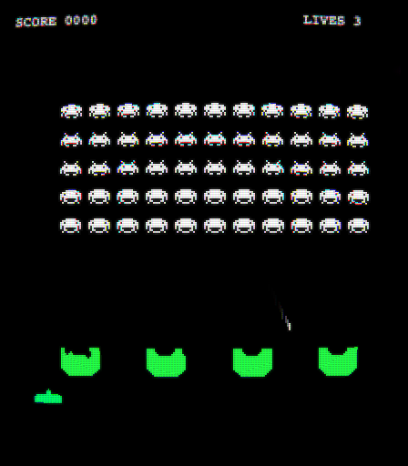

# Phosphor 78 -- 游戏本身

> 1978 Taito _Space Invaders_ 街机版的博物馆级浏览器复刻。
> WebGL CRT 着色器 + Web Audio 振荡器图谱芯片合成 + 引用 ROM 的游戏常量
> -- 三根支柱独立搭建，最后接缝处对齐。

这份文档讲的是已经实现的产物：它能干什么、怎么组织、各模块各自负责什么。
关于元层面的故事（这个项目本质是一次 BMAD 端到端实践），
见 [bmad-practice.zh.md](bmad-practice.zh.md)。

**状态**：✅ v1 候选（见 [v1 checklist](v1-checklist.md)）
**平台**：桌面浏览器（Chrome / Firefox / Safari，近期版本）
**技术栈**：TypeScript 6 strict / Vite 8 / Vitest 4 / Playwright 1

<p align="center">
  
  &nbsp;
  
  &nbsp;
  
</p>

## 你今天就能做的事

- 跑 `pnpm dev`，玩一整局 Space Invaders：把 squid / crab / octopus
  阵型打下来（每杀一个按 ROM 表得 30 / 20 / 10 分，附短爆炸 sprite），
  躲在被一点点啃掉的堡垒后面（每次命中挖出一个子弹形缺口；
  下来的 alien 会把堡垒啃出一条隧道），打 UFO 拿循环表决定的奖励分，
  死三次后到 game-over 按 Enter 重开。
- 打开 `/behind-the-scenes/` 阅读 4000 字教学散文（中英可切换），
  拖动 9 个实时滑杆，听 6 种事件合成器，
  看音频时钟实时推进，给每种波形画示波器。

## 三大支柱

### 1. 看起来像 1978 的 CRT

WebGL2 管线：场景画布 → 离屏 RGBA16F framebuffer →
荧光残留 ping-pong → 合成着色器 → 主画布。
三档合成（Low / Mid / High）在构建时编译；
运行时档位走法按 URL `?tier=` 覆盖、localStorage 存档、
或 GPU 能力探测三者之一选档。
效果：枕形畸变、扫描线压暗、网格点掩膜、光晕辉光、色散。
见 [CRT 着色器章节](../src/companion/content/crt-shader.zh.md)。

### 2. 听起来像 1978

自家 AudioWorklet 振荡器，带 SN76477 风格的“电路热度”
（逐周期抖动、软预削波、不对称三角波、LFSR 噪声）。
采样精确的 ADSR 包络 worklet。六种逐事件合成器
（行进、开火、爆炸、外星人被击毙、UFO、UFO 被击毙），
每种带不同 LFSR 种子。整个 bundle 不含任何音频文件。
见 [芯片合成章节](../src/companion/content/chip-synth.zh.md)。

### 3. 玩起来像 1978

每一个游戏常量都引用了
[ComputerArcheology 反汇编](https://computerarcheology.com/Arcade/SpaceInvaders/)
对应的地址。行进节奏表、saucer 计分循环（包含著名的 off-by-one bug）、
堡垒位图、外星人分数 -- 全部按 ROM dump 一字不差，
版本冻结在 git tag `reference-snapshot-v1`。
音频时钟是主，渲染循环是从。
见 [时序章节](../src/companion/content/timing.zh.md)。

## 快速开始

```bash
pnpm install
pnpm dev          # 游戏在 http://localhost:5173
pnpm test         # 单元测试（396 通过）
pnpm test:e2e     # Playwright e2e（16 通过）
pnpm build        # 生产构建（约 70KB，gzip 后 companion 约 16KB）
```

## 架构

按领域驱动的 5 层源码树：

```
src/
├── foundation/    # WebGL 上下文、framebuffer、shader 助手、像素管线
├── render/        # CRT 管线、各 pass、场景光栅化器、可调参数
├── audio/         # AudioClock、AudioWorklets、逐事件合成器、引擎
├── game/          # 纯 reducer + 子 reducer（CR1：无副作用）
├── persistence/   # localStorage 存档 schema 加版本迁移
├── boot/          # 能力探测、降级走法
├── companion/     # behind-the-scenes 页（滑杆、可视化器、散文）
├── constants/     # ROM 引用游戏常量（带覆盖测试）
├── util/          # Result、log、迷你信号 store、坐标
└── types/         # GameState / 事件 / clock 接口
```

ESLint 强制的架构边界（story 1.2）：

- `game/` 不能 import `render/` `audio/` `companion/` `debug/`
- 除配置文件外全仓 `import/no-default-export`
- 全仓 `import/no-relative-parent-imports`

完整的架构文档 -- 11 个 ADR、8 个跨领域关注点、13 个系统、
8 条架构边界（AB1-AB8）、14 条一致性规则（CR1-CR14） --
在 [\_bmad-output/game-architecture.md](../_bmad-output/game-architecture.md)。

## 致谢

- **西角友宏（Tomohiro Nishikado）** -- 1978 在 Taito 设计了 Space Invaders，
  从此改变一切。
- **Chris Cantrell** -- 把 ROM 反汇编了，发布在
  [ComputerArcheology](https://computerarcheology.com/Arcade/SpaceInvaders/)。
  没有他的反汇编 + 注释，这个项目就是瞎猜。
- **Timothy Lottes** -- 本项目合成阶段用的枕形 CRT 着色器模式来自他。
- **TroggleMonkey 与 libretro 贡献者们** --
  [CRT-Royale](https://github.com/libretro/slang-shaders) 是着色器栈的第二参考。
- **Ken Shirriff** -- SN76477 音效芯片的 die 级反向工程
  指引了 AudioWorklet 的“电路热度”决策。
- **Chris Wilson** -- _A Tale of Two Clocks_ 是音频用的前瞻调度模式的标准引用。

完整的参考快照（ComputerArcheology HTML、libretro 着色器源、
原版音频录音、CRT 近景照片）在 git tag `reference-snapshot-v1`。
归档内容与各文件法律状态见
[references/README.md](../references/README.md)。

## <a id="legal"></a>法律

Phosphor 78 是 1978 Taito _Space Invaders_ 街机的**非官方致敬 / 教学研究品**。
与 Taito Corporation 或 Square Enix 无任何关联、未获背书、未获授权。

- **非商用** -- 仅限个人 portfolio 与教学
- _Space Invaders_ 的所有商标、角色设计、玩法概念归 Taito Corporation 所有
- 本仓库源码不含任何 Taito 原始素材
- 堡垒位图与行进节奏表来自 ComputerArcheology 公开发布的反汇编，
  按公平使用（教学性解读）原则复刻
- 用户提供的原版音频录音放在
  `references/audio/youtube-longplay-source-B.mp3`，仅用于频谱分析，
  不打包进构建产物
- 收到下架请求会及时响应

不授权对原版 Space Invaders IP 衍生作品的任何许可。
项目自身的原创代码（`src/` 与内联着色器源等所有内容）
v1 发布之前暂未授权。
